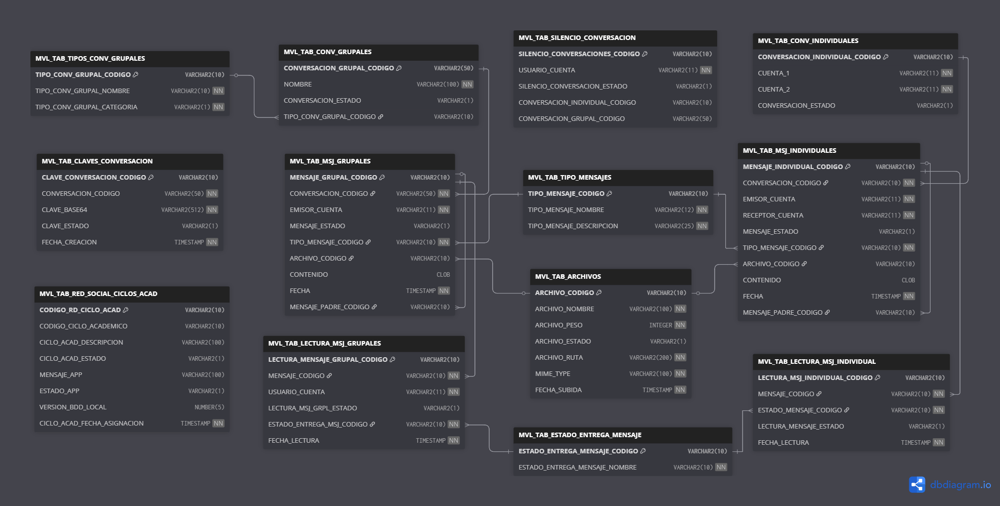
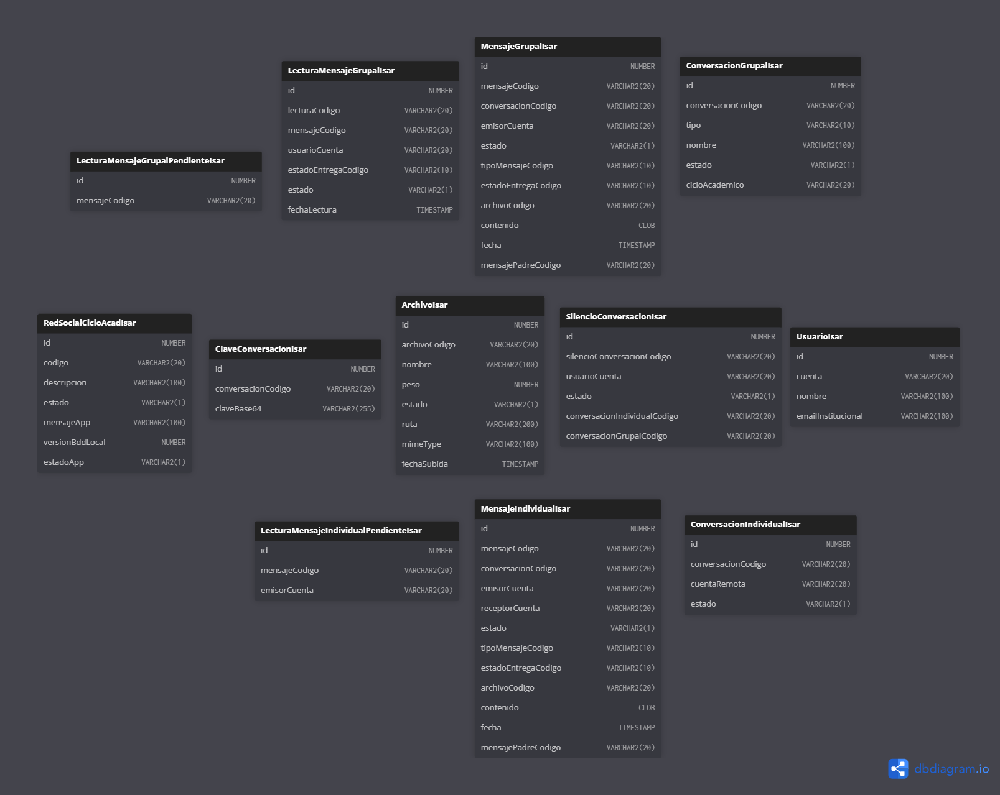

# Base de Datos – Chat UTN

Este repositorio contiene los modelos de datos utilizados en el sistema de mensajería institucional **Chat UTN**, desarrollado para la Universidad Técnica del Norte. Se incluyen dos representaciones complementarias:

- 📦 **`backend-oracle/`** → Modelo relacional para Oracle (SQL completo con vistas, triggers, procedimientos, etc.)
- 📱 **`frontend-flutter-isar/`** → Representación de datos NoSQL usando colecciones Isar (base de datos local en Flutter)

---

## 📁 Estructura del repositorio
```
│
├── README.md
├── backend-oracle/
│   ├── base-de-datos-completa.sql
│   ├── chat-utn-entidad-relacion-oracle.png
│   └── modelo-entidad-relacion-oracle.txt
│
└── frontend-flutter-isar/
    ├── chat-utn-colecciones-flutter-isar.png
    └── chat-utn-colecciones-isar.txt
```


## 🔗 Enlaces rápidos

### 📌 Modelo relacional (Oracle)
Este modelo representa las **tablas del backend Oracle**, con relaciones explícitas (foreign keys), tipos de datos, vistas, procedimientos y triggers definidos.


- 📝 [Ver diagrama interactivo en dbdiagram.io](https://dbdiagram.io/d/bdRedSocialMensajeria-Version-final-68a7ac221e7a6119670d8d4f)
- 📄 [`modelo-entidad-relacion-oracle.txt`](./backend-oracle/modelo-entidad-relacion-oracle.txt)


### 📌 Modelo NoSQL (Isar - Flutter)

Esta representación refleja la estructura de datos local en Flutter usando **Isar**, una base de datos NoSQL.  
A diferencia del modelo relacional, aquí no existen claves foráneas ni relaciones explícitas.  
Cada `@Collection()` se representa como una tabla independiente, con campos que pueden referenciar códigos de otras colecciones, pero sin uniones automáticas ni integridad referencial forzada.

> Esta es una forma de representar estructuras NoSQL en estilo entidad-tabla, útil para documentar o visualizar cómo se organizan los datos dentro de Isar.



- 📝 [Ver representación interactiva en dbdiagram.io](https://dbdiagram.io/d/UTN-Movil-Red-Social-Flutter-Version-Final-68640f62f413ba3508c384ca)
- 📄 [`chat-utn-colecciones-isar.txt`](./frontend-flutter-isar/chat-utn-colecciones-isar.txt)


---

## ⚙️ Instrucciones para el DBA

Para el despliegue en el entorno de producción de la **Red Social de Mensajería (Chat UTN)**, se requiere apoyo del encargado de base de datos con las siguientes tareas:

1. **Acceso a la base de datos de producción**  
   - Validar que el usuario del proyecto `UTN_MOVIL` tenga acceso a la base de datos de producción.

2. **Creación de vistas**  
   - Crear las vistas especificadas en el script [`base-de-datos-completa.sql`](./base-de-datos-completa.sql).  
   - Estas vistas permiten la consulta de estudiantes y docentes con su cuenta, cédula, nombre y correo institucional.

3. **Permisos sobre tablas**  
   - Crear y asignar **permisos de escritura** en las tablas del módulo de mensajería al usuario `UTN_MOVIL`.  
   - Esto permitirá insertar y actualizar datos en las tablas del sistema de mensajería.

4. **Directorio para archivos**  
   - Crear el directorio físico en el servidor de base de datos:  
     ```
     CREATE OR REPLACE DIRECTORY UTN_MOVIL_RED_SOCIAL_DIR AS '/utn_movil/red_social/archivos';
     ```
   - Otorgar permisos de lectura y escritura al usuario `UTN_MOVIL`:
     ```sql
     GRANT READ, WRITE ON DIRECTORY UTN_MOVIL_RED_SOCIAL_DIR TO UTN_MOVIL;
     ```

5. **Procedimiento para carga de archivos**  
   - El script incluye el procedimiento `SUBIR_ARCHIVO_RED_SOCIAL_PROC`, que permite registrar metadatos en `MVL_TAB_ARCHIVOS` y guardar el archivo en el directorio antes mencionado.
   - Este procedimiento depende de los permisos del usuario `UTN_MOVIL` sobre el directorio `UTN_MOVIL_RED_SOCIAL_DIR`.

---

## 📌 Nota

En caso de dudas o de requerir ajustes de permisos adicionales, el equipo de desarrollo puede coordinar directamente con DDTI.

