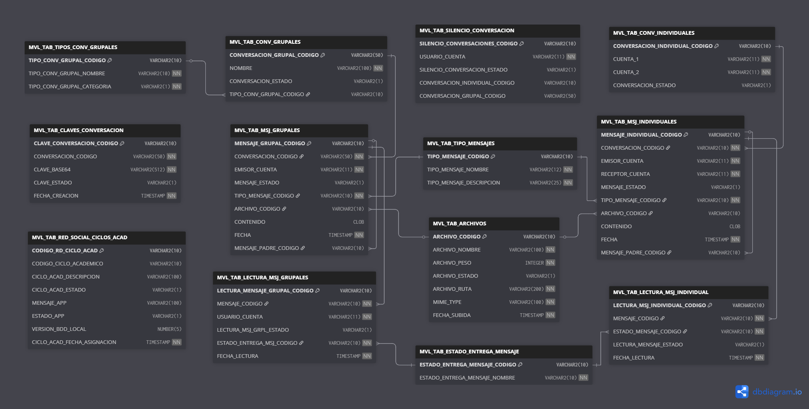

# Base de Datos – Chat UTN

Este repositorio contiene el modelo de datos de la **Red Social de Mensajería (Chat UTN)**.  

---

## 📌 Modelo Entidad-Relación

El modelo entidad-relación se puede visualizar directamente aquí:



### Otras formas de verlo
- Si desea ver el diagrama con **notas, claves y relaciones interactivas**, puede abrir el archivo [`modelo-entidad-relacion.txt`](./modelo-entidad-relacion.txt) en [dbdiagram.io](https://dbdiagram.io).  
- También puede acceder directamente al diagrama en línea desde este enlace:  
  👉 [Ver en dbdiagram.io](https://dbdiagram.io/d/bdRedSocialMensajeria-Version-final-68a7ac221e7a6119670d8d4f)

---

## 📌 Modelo Físico

El modelo físico completo se encuentra en [`base-de-datos-completa.sql`](./base-de-datos-completa.sql).  
Este script incluye:

- Creación de tablas  
- Vistas  
- Procedures  
- Índices  
- Secuencias y triggers para generación automática de códigos  

---

## ⚙️ Instrucciones para el DBA

Para el despliegue en el entorno de producción de la **Red Social de Mensajería (Chat UTN)**, se requiere apoyo del encargado de base de datos con las siguientes tareas:

1. **Acceso a la base de datos de producción**  
   - Validar que el usuario del proyecto `UTN_MOVIL` tenga acceso a la base de datos de producción.

2. **Creación de vistas**  
   - Crear las vistas especificadas en el script [`base-de-datos-completa.sql`](./base-de-datos-completa.sql).  
   - Estas vistas permiten la consulta de estudiantes y docentes con su cuenta, cédula, nombre y correo institucional.

3. **Permisos sobre tablas**  
   - Crear y asignar **permisos de escritura** en las tablas del módulo de mensajería al usuario `UTN_MOVIL`.  
   - Esto permitirá insertar y actualizar datos en las tablas del sistema de mensajería.

4. **Directorio para archivos**  
   - Crear el directorio físico en el servidor de base de datos:  
     ```
     CREATE OR REPLACE DIRECTORY UTN_MOVIL_RED_SOCIAL_DIR AS '/utn_movil/red_social/archivos';
     ```
   - Otorgar permisos de lectura y escritura al usuario `UTN_MOVIL`:
     ```sql
     GRANT READ, WRITE ON DIRECTORY UTN_MOVIL_RED_SOCIAL_DIR TO UTN_MOVIL;
     ```

5. **Procedimiento para carga de archivos**  
   - El script incluye el procedimiento `SUBIR_ARCHIVO_RED_SOCIAL_PROC`, que permite registrar metadatos en `MVL_TAB_ARCHIVOS` y guardar el archivo en el directorio antes mencionado.
   - Este procedimiento depende de los permisos del usuario `UTN_MOVIL` sobre el directorio `UTN_MOVIL_RED_SOCIAL_DIR`.

---

## 📌 Nota

En caso de dudas o de requerir ajustes de permisos adicionales, el equipo de desarrollo puede coordinar directamente con DDTI.


## 🗂️ Archivos del repositorio

- `chat-utn-entidad-relacion.png` → Imagen del diagrama ER  
- `modelo-entidad-relacion.txt` → Definición ER en formato dbdiagram.io  
- `base-de-datos-completa.sql` → Script SQL con modelo físico completo  
- `README.md` → Este archivo  

---
